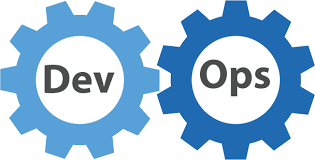

# DevOps Lernjournal

## Regeln Lernjournal

### Repository
* Eigenes *privates* Haupt-Repository basierend auf dieser Vorlage erstellen ✅
* Weitere vorgegebene *private* Repositories verwenden ✅
* Alle Repositories müssen an [mosazhaw] (https://www.github.com/mosazhaw) freigegeben sein ✅ 

### Struktur
* Kapitelstruktur inkl. Nummerierung einhalten (die Reihenfolge, Struktur und Bezeichnung der Titel und Untertitel darf nicht verändert werden) ✅ (leicht verändert)
* Es dürfen weitere Untertitel (4. Ebene mit ####) ergänzt werden ✅

### Inhalt
* Deutsch, Markdown ✅
* Inhaltsverzeichnis und URL zu Repositories und Webseiten müssen klickbar sein (Links) ✅
* [ ] TODO bezeichnet Stellen, wo Text und/oder Grafiken/Screenshots ergänzt werden sollen ✅
* Vorgegebene Tabellen zu Beginn der jeweiligen Kapitel müssen belassen werden ✅

### Bilder, Grafiken und Screenshots
* Es dürfen keine externen Bilder, Grafiken oder Screenshots verknüpft werden ✅
* Bilder, Grafiken und Screenshots müssen alle im jeweiligen Unterordner "images" abgelegt *und im Bericht sichtbar verknüpft* werden, ein Beispiel:

## Nachvollziehbarkeit Eigenständigkeit

* Verwendung des eigenen Kürzels/Namen/Accounts in Projektnamen, Datei-Pfaden, Repositories, Docker-Images, Docker-Containern und weiteren wählbaren Bezeichnungen ✅
* Sichtbarkeit des eigenen Kürzels/Name/Accounts auf Screenshots ✅
* Screenshots passend zu aktuellem Datum, verwendeter Hard-/Software, Versionen ✅
* Inhalte Projektbericht passend zu Screencast ✅

## Inhalt

Link auf separates Git-Repo für jedes Kapitel. ✅

- [01 Version Control](https://github.com/kadi1996/DevOps-01-Version-Control)
- [02 Build](https://github.com/kadi1996/DevOps-02-Build)
- [03 DevOpsDemo](https://github.com/kadi1996/DevOps-03-DevOpsDemo)
- [03 DevOpsDemo2](https://github.com/kadi1996/DevOps-03-DevOpsDemo2)
- [04 Containers](https://github.com/kadi1996/DevOps-04-Containers)
- [05 Unit Tests](https://github.com/kadi1996/DevOps-05-Unit-Tests)
- [06 Quality](https://github.com/kadi1996/DevOps-06-Quality)
- [07 CI1](https://github.com/kadi1996/DevOps-07-CI1-DevOps-08-CI2)
- [08 CI2](https://github.com/kadi1996/DevOps-07-CI1-DevOps-08-CI2?tab=readme-ov-file#lernjournal-cicd-part-2)
- [09 Deployment Docker](https://github.com/kadi1996/DevOps-09-Deployment-Docker)
- [10 Deployment Cloud](https://github.com/kadi1996/DevOps-10-Deployment-Cloud)

## Einführung

### Person, IT-Know-How

- Grundkenntnisse im Programmieren: Java und Python
- Grundkenntnisse HTML, XML und CSS 
- ZHAW MSc. Wirtschaftsinformatik im letzten Semester
- Seit Juni 2024 Support Engineer für Atlassian Produkte
- Eher wenig technisches Verständnis
- Durchführung von Software Updates (hauptsächlich Jira & Confluence) auf die neuste LTS & Security Patching

  

### Bezug zu DevOps und Motivation für das Modul

- keine Erfahrung bzw. Praxis in einem DevOps Team
- Interesse an Agiler IT Organisation
- Masterarbeit zum Thema DevOps Implementation und Critical Success Factors, qualitative Studie durchgeführt mit 13 Partizipanten
- Motivation:
  - Theoretisches Wissen durch Praxis zu erweitern
  - Verstehen, wie man reibungslos zwischen Entwicklung und Betrieb vermittelt
  - Technisches Wissen und Fähigkeiten ausbauen, daher möchte ich nicht nur bestehen, sondern auch verstehen 
      -> Grund warum ich letztes Jahr meine Projekte nicht (bzw. mangelhaft) abgegeben habe und das Modul wiederholen wollte
  - Ich finde Ops und Infrastrukturen spannend und würde es gerne in diesem Rahmen näher kennenlernen
 
    
### Verwendete Hardware / Betriebssystem

- Apple MacBook Air M1 2020
- 16GB Arbeitsspeicher
- macOS Seqouia Version 15.4 (Stand 31.03.2025)
- Da wir ein BYOD Konzept haben, nutze ich ein Laptop für privates und berufliches und muss regelmässig System- und Software Updates machen   

## Peer-Feedback
| | Bitte Ausfüllen |
| ------- | ------- |
| Review durch | guenekad |
| Screencast von | filipkar |
|  | Sprache, Kommunikation, roter Faden Sprachlich klar, sauber und sehr gut strukturiert. Kommunikation präzise und eloquent. Roter Faden deutlich erkennbar. |
| Nachvollziehbarkeit Inhalt, Demonstaration | Der Inhalt ist durchgehend sehr gut nachvollziehbar und gut erklärt. Demos waren anschaulich und praxisnah, was das Verständnis zusätzlich erleichtert hat. Alles in Allem eine gelungene Präsi |

## Persönliches Fazit der Vorlesung

- Viele neue und komplexe Tools kennengelernt und deren Zusammenspiel besser verstanden
- Technische Arbeit bedeutet oft Detailarbeit und Geduld
- Fehler gehören dazu – nicht alles klappt auf Anhieb
- Erwartungshaltung ist oft schwieriger als die eigentliche Komplexität
- Gute Prozesse brauchen Zeit, Struktur und Ausdauer
- Konsistente Benennung (Commits, Images etc.) ist essenziell für Nachvollziehbarkeit
- Klare Dokumentation unterstützt die Teamarbeit erheblich
- Gesamtfazit/-Eindruck: DevOps-Skills sind erlernbar – mit Ruhe, Struktur und der richtigen Unterstützung

Vielen Dank 🙏
